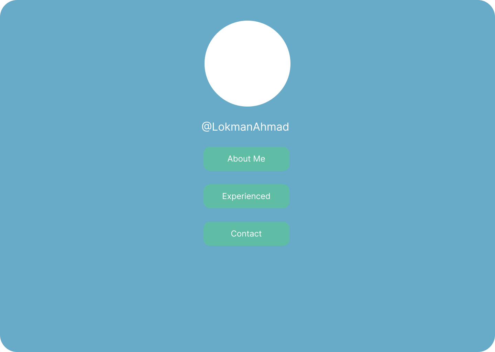

# Curriculum-Vitae

## https://veloct84.github.io/Curriculum-Vitae

### Lession 1 : Creating basic html that require:

- Text
- Division (div)
- Create more pages and link each other

### Extra:

- Use semantic element
- Use any picture for this lession

### Idea

